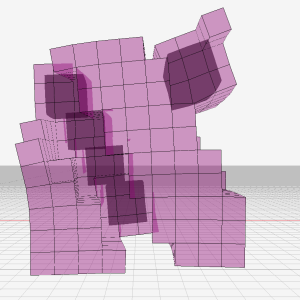
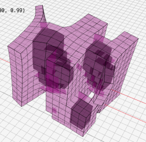
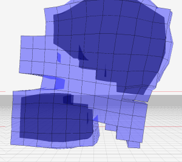

The code for my master's thesis "Evolving steerable pneumatic soft robots".



This code uses the CPPN-NEAT algorithm to simultaneously evolve the body and controller of voxel-based soft robots with realistic pneumatic actuation and sensing. The two tasks supported are simple gait learning and directed locomotion. Videos of some of the resulting robots can be seen [here](https://youtu.be/mJRQac5HiFE). For more information, see [my thesis](softrobots_final2.pdf).


Dependencies
------------

Using [voxelyze](https://github.com/jonhiller/Voxelyze/tree/master) for simulation and [raylib](https://github.com/raysan5/raylib) ([compiled statically](https://github.com/raysan5/raylib/wiki/Working-on-GNU-Linux)) for visualization. We use the evolutionary algorithms module [neat-python](https://github.com/CodeReclaimers/neat-python), and [tiny-dnn](https://github.com/tiny-dnn/tiny-dnn/tree/master) for the NN controllers.

Installation
------------

The folder structure should be like this:
```
cpu_voxelyze
|- pneuvox (this repo)
|- raylib
|- tiny-dnn
|- Voxelyze
```

Compiling tiny-dnn
------------------

Tiny-dnn is header-only so doesn't need to be compiled separately.

Compiling Voxelyze
------------------

Use my personal fork (https://github.com/th555/voxelyze) on the branch `fixext`, then just run `make`

Compiling Raylib
----------------

Skip this step on the DAS-6 cluster!

Run `make` in its directory, then copy `raylib.h` and `raymath.h` from `raylib/src` to `raylib/include` and move `libraylib.a` from `raylib/src` to `raylib/lib`


Compiling Pneuvox locally
-------------------------

Normal `make` builds a local version, requiring Raylib for visualization.


Compiling Pneuvox on DAS-6
-------------------------

`make das6` builds a version optimized for the DAS-6 cluster, with compiler options for best performance on its CPUs, and no visualization. You can also add `-march=znver2` to the makefile.


Installing Python dependencies
-----------------------------
Make sure you have numpy and scipy, on DAS-6 this is
```
module load py3-numpy
module load py3-scipy
```
Install other deps:
```
pip install -r evo/requirements.txt
```
or on the das:
```
python3 -m pip install --user -r evo/requirements.txt
```


Viewing some robots
-------------------

For a quick check if the installation/compilation succeeded, try loading some of my previously evolved robots:
```
python evo/replay.py bestbots/500_mdv2_open
```

Viewer controls
----

RMB: pan
alt+RMB: rotate view
ctrl+alt+RMB: zoom with mouse
scroll wheel: zoom
R: reset simulation
esc: exit


Running on DAS-6
----------------

Start every session on the das with `module load prun`.

Basic prun:
`prun -v -np 1 -1 python3 -u evo/run.py experiment_name`

Restoring an evolution run at a generation checkpoint:
`prun -v -np 1 -1 python3 -u evo/run.py restore saved_data/10x10/checkpoint_23`

Long running job, you can safely log off ssh (not allowed during working hours!):
`nohup 2>&1 prun -v -np 1 -1 -asocial -t 09:00:00 python3 -u evo/run.py experiment_name > experiment_name.out &`

(keep an eye on it with `watch -n 5 tail -n 40 experiment_name.out`)

(though of course it's better to use a `screen` instead of `nohup`)


Retrieving your results
-------------------

To transfer files from the DAS, via the stepping-stone server, to your local computer:
`scp -oProxyJump=tmk390@ssh.data.vu.nl tmk390@fs0.das6.cs.vu.nl:cpu_voxelyze/pneuvox/exp_results/results.tar.gz exp_results/results.tar.gz`

If it complains ("received message too long..."), try putting this on top of bashrc on the das6:
```
# If not running interactively, don't do anything and return early
[[ $- == *i* ]] || return
```
